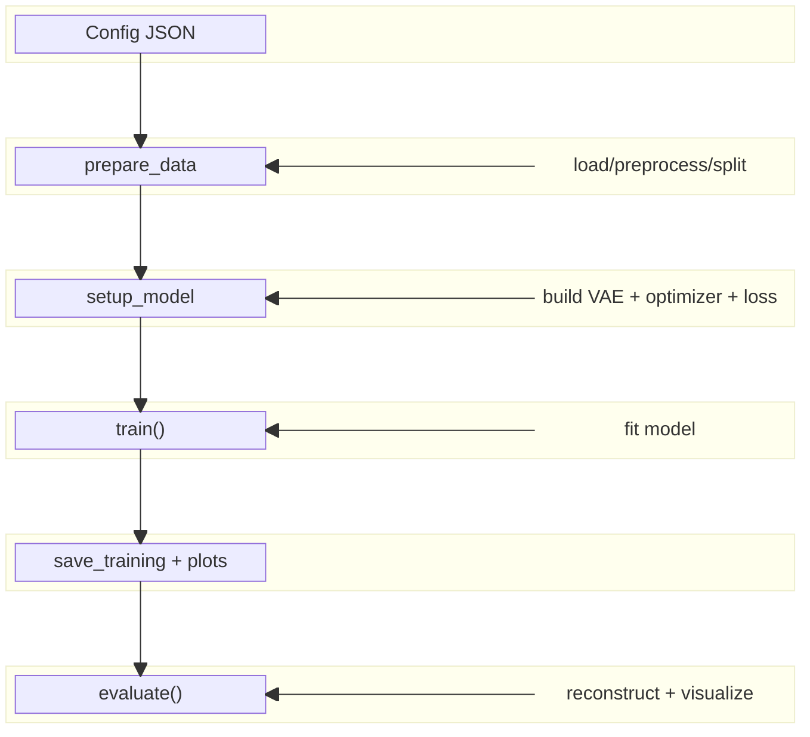

# Script Guide: `vae_training.py`

This guide provides a modular summary of the VAE (tabular) training script and its usage.

- **Title:** VPE Training Script Guide
- **Script:** src/vae_training.py
- **Uses:** config-driven, fully modular, supports output plots
- **View in browser or offline**



---

## 🧭 Structure overview

- `TrainerConfig`: Loads from json config with parameters
- `VAETrainer` class:
  - `prepare_data()` | Loads and scales data
  - `setup_model()` | Instantiates a VAE model with optimizer and loss
  - `prepare_data_loaders()` | Wrap sets in `DataLoader`s
  - `train()`       | Trains the model
  - `save_training()`  | Saves model and training history
  - `evaluate()`    | Runs reconstruction evaluation
  - `model_summary()` | Outputs layers + parameter summary
  - `plot_training_metrics()` | Generates training curves plots

## 🛠️ CLI and Entrypoint

Run the script from the command line with:

```bash
python src/vae_training.py --config_path configs/trainer_config.json
```

- The script accepts a `config_path` argument (optional).
- If run inside a Jupyter or VS Code Interactive session, the script skips CLI
  parsing and uses:

```bash
def main(config_path: Optional[Union[str, Path]] = None, verbose: int = 1)
```

## 📂 Outputs

- If `use_timestamp_output_dir = true` in the config, outputs are saved in a
  subdirectory named `run_<timestamp>` inside `output_dir`.

Default output goes to a timestamped or configured directory and includes:

- `trained_model_weights.pth`
- `training_history.json`
- `latent_space.png`
- `reconstruction_feature_X.png`
- `model_summary.txt`
- Training plots (loss, optional metrics)

## 🚁 Common tasks with this script

- Fine-tune architecture: `setup_model()` and `build_vae_model_from_params()`
- Add custom loss function: `setup_model()`
- Swap reconstruction method: `evaluate()`
- Debug shape mismatch: `prepare_data()` + model track
- Replot results: `plot_training_metrics()`.
- Use `configs/trainer_config.json` to change input, dimensions, outputs

## 🛠️ Developer Task Reference

This table summarizes common actions you'll need to perform when working with `vae_training.py`, and where to do them in the codebase or configuration.

| **Task**               | **Where/How to Do It**                               | **What to Know**                                                                 |
|------------------------|------------------------------------------------------|----------------------------------------------------------------------------------|
| **Change architecture** | Inside `setup_model()`, which calls `build_vae_model_from_params()` | Define encoder/decoder layers, activations, etc. via the training config file.   |
| **Adjust loss function** | `setup_model()`                                     | You can choose different loss components or tweak weights using the config.      |
| **Evaluate a saved model** | Use `evaluate()` after loading weights              | Make sure the model and scaler are initialized properly before calling.          |
| **Add new metrics**     | In `train()` and `plot_training_metrics()`          | The config can specify extra metrics to track and visualize (e.g., accuracy).    |
| **Generate model summary** | Call `model_summary()`                             | Saves a `.txt` file summarizing layer types, dimensions, and parameter counts.   |
| **Run from notebook**   | Call `main("configs/trainer_config.json")` manually | Enables running inside Jupyter or VS Code Interactive; bypasses CLI parsing.     |